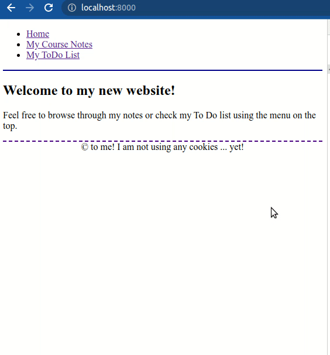
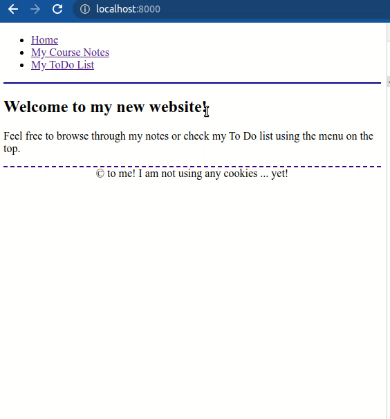
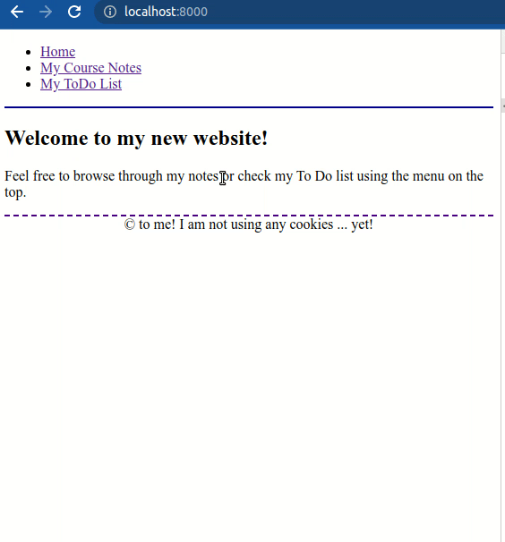
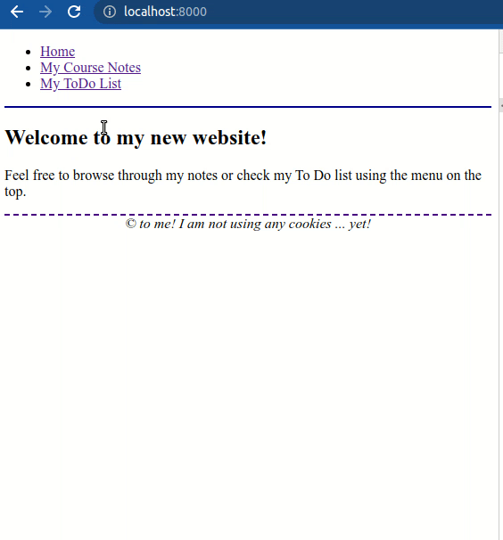

# Django Forms

## Description

In this exercise, we will add forms to the **Notes & Todos** website from the [previous exercise](https://github.com/dci-python-course/Python-basics-django-views-and-templates).

## Initial Data

Use the Django project you worked on in the exercise about [Views and Templates](https://github.com/dci-python-course/Python-basics-django-views-and-templates).

Alternatively, you can  use the [solution provided](https://github.com/dci-python-course/Python-basics-django-views-and-templates/tree/solution_task5/solution/course) at the end of that exercise.

> If you do so, make sure your virtual environment has all the necessary dependencies by moving into the `course` directory and typing:
>
> `(env) $ pip install -r requirements.txt`

## Tasks

### Task 1

The **Notes & Todos** website is starting to look good. Maybe not very visually attractive, but it has a few pages that can be navigated through.

There is at least one view, the search view, that is not very usable. We have to change the URL manually and the visitor doesn't know that.

Your first task is to define a new endpoint `search/` that shows a form with an input text element, a select element (a dropdown) with the sections available and a submit button.

The input field should be required and when the user submits the form it should show the list of results we already have in the `notes/<str:search_term>/` endpoint.

The select field should not be required. If the user doesn't select any option, the search should not be filtered by section.

When the user submits the form, the search parameters (term and section) should be passed on in the query string with the GET method. We want the users to be able to bookmark the search results.

Finally, add a link to the new view `search/` in the home view of the `notes` app.

**Once you are done, your website should look similar to this:**



### Task 2

The To Do list may be something very personal and you may not want other people to have access to it.

Refactor the **todo details view** so that it shows an authentication form instead of the content. Only if the form is submitted and the credentials are valid, the view will show the content.

> You can hard-code the credentials for this exercise.
>
> You will have to create a new template extending the main `common/base.html` template.

**Once done, your website should look similar to this:**



The usability is still very low, as we have to identify ourselves at each request, but we have managed to keep our todos secret.

### Task 3

In this next task, you will create a form to add new notes to the website.

To do so, first copy the file located at [resources/task3/store.py](resources/task3/store.py) into [config/store.py](config/store.py) in your project.

This file has a simple class instance to retrieve and store data into files as JSON.

Once you have that, replace your [notes/models.py](notes/models.py) with the file at [resources/task3/notes/models.py](resources/task3/notes/models.py).

To use this new interface, in your view, you will have to replace the line:

```
from notes.models import notes
```

With these lines:

```
from notes.models import NoteStore


store = NoteStore()
notes = store.get()
```
With this, all the views in your notes app should work as they used to.

Additionally, the `store` object has another method named `save` that will replace the content with the given one:

`store.save(list_of_notes)`

Once you have that, create the view, the template, the path and the form so that you can add new notes.

A note has two properties (the section and the text) so the form will need two fields, both of type `CharField`. For the text field, we want a bigger input field where we can type multiple lines (an HTML `textarea` element).

Additionally, add a new link in your notes home view pointing to the add view.

> Hint: when saving the data, the store is always replacing the file, so you will have to pass the whole list of notes to the store `save` method each time you want to save.

**Once you are done, your website should look similar to this:**



### Task 4

Your next form will be used to edit the notes. You will add a link in the note details view. This link will point to a new endpoint `notes/{id}/edit/` linked to a new view that will show a similar view to the **add note** view.

The edit functionality has been defined as a feature of the note's text, not of the note object, so the form will show both the note's section and the text, but the first must be disabled.

Define a common template `form.html` for both this view and the **add note** view. Each of these views should extend this template and override any values required.

The form will have to load with the values of the note identified by the `id` indicated in the URL (according to the note's position in the given list).

> If you lose the data, simply delete the file `data/notes.json` in your repository and restart the Django development server.

Once the note's text is edited and the user clicks on submit, the form will have to save the data (calling `store.save(all_notes)`) and then it will have to redirect to the edited **note details** view.

**Once you completed the task your website should look similar to this:**


